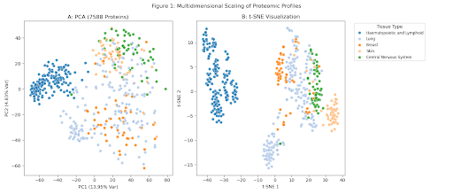
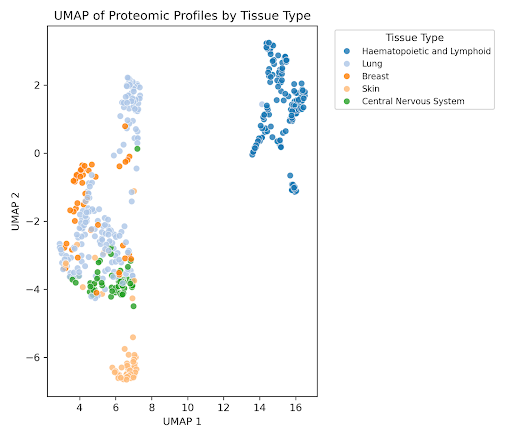
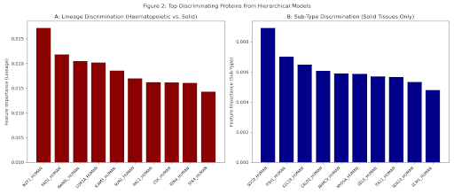

# Cancer-Proteome-Hierarchical-Classifier
A hierarchical machine learning framework using Random Forest to classify cancer cell line lineage and subtype from pan-cancer proteomic maps. Demonstrates high-dimensional data preprocessing, EDA (PCA/t-SNE/UMAP), and biomarker identification.

# Project Overview

This project implements a Hierarchical Random Forest Classification framework to determine the tissue of origin for 949 human cancer cell lines using quantitative proteomic data. By leveraging a two-stage hierarchical approach, the model mimics the natural biological identity of cells—first separating broad lineages before identifying specific tissue subtypes.

# Core Objectives

The primary goal of this study was the hierarchical classification of 949 human cancer cell lines based on a pan-cancer proteomic map. The methodology involved the implementation of a Lineage-First strategy to handle molecular phenotype convergence and class imbalance. A major focus was the identification of the primary protein drivers, or biomarkers, behind tissue-specific identity.

# Key Technical Features

The project involved processing over 8,000 protein features and applying stringent filtering where tissues with fewer than 50 samples were excluded and proteins quantified in less than 10% of samples were removed. Exploratory Data Analysis was performed using PCA, t-SNE, and UMAP to visualize global-local tissue organization. The hierarchical architecture consisted of Model 1, which distinguished Haematopoietic from Solid cancers, and Model 2, which classified Lung, Breast, Skin, and CNS subtypes within the solid tissue group.

# Performance and Results

Model 1 achieved 100.0% accuracy for lineage separation. Model 2 achieved a mean cross-validated accuracy of 84.0% for subtype discrimination within the solid tissue subset.

# Biomarker Insights

Feature importance analysis identified biologically plausible discriminating proteins. TAL1 and CSK were identified as primary markers for immune-derived lineages. SOX10 was highlighted for subtype discrimination, alongside cytoskeletal regulators such as VINC and PLEC for epithelial functional programs. The analysis also revealed a proteomic overlap between Breast and CNS tumours, reflecting shared molecular programs linked to high metastatic tropism.

# How to Reproduce

1. Clone the Repo: git clone https://github.com/NuruKhaliel96/Cancer-Proteome-Hierarchical-Classifier.git

2. Install Requirements: pip install -r requirements.txt

3. Acquire Data: Download mmc2.xlsx and mmc3.xlsx as directed in the data/README.md.

4. Run Analysis: Execute src/analysis_script.py.
